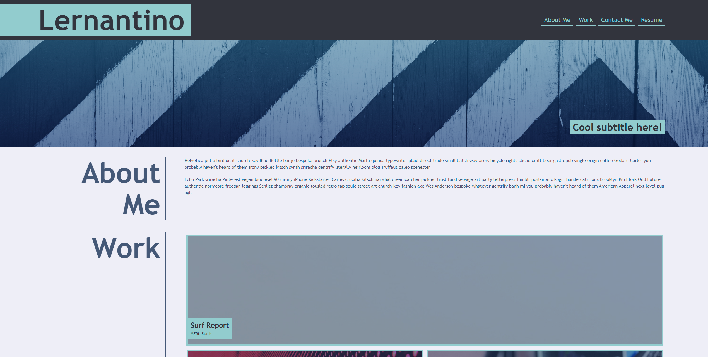
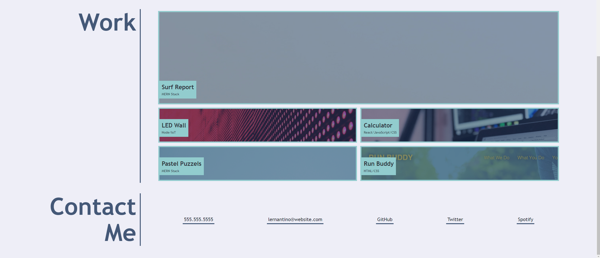

# Advanced CSS Challenge: Professional Portfolio
## By Sultan Siddiqi
## Email: sultan.siddiqi@gmail.com
## GitLab Profile: sultansiddiqi

## Link to Challenge 
https://sultansiddiqi.github.io/Challenge-02-ProfessionalPortfolio/

## Project Description
The purpose of this project is to create a Professional Portfolio that can dislpay some of my learned CSS and HTML skills. This also allows me to display as well as link some of my projects, assignments and work.

```
Assignment Instructions: 
 This week, you'll build a portfolio page, which you can add to as the course progresses.

A portfolio of work can showcase your skills and talents to employers looking to fill a part-time or full-time position. An effective portfolio highlights your strongest work as well as the thought processes behind it. Students who have portfolios with deployed web applications (meaning they are live on the web) are typically very successful in their career search after the boot camp. This last point can’t be stressed enough: having several deployed projects is a minimum requirement to receive an initial interview at many companies.

With these points in mind, in this Challenge you’ll set yourself up for future success by applying the core skills you've recently learned: flexbox, media queries, and CSS variables. You'll get to practice your new skills while creating something that you'll use during your job search. It’s a win-win that you'll likely be grateful for in the future!
```

## Overview of Webpage
- Webpage includes a HEADER, TITLE, and Functioning NAV BAR
- A hero section with some text
- About me section with a short paragraph about me
- Work section which displays some work as well as placeholder labels for visual effect
- Contact me Section which has working links and relevant contact info
- Formatted and styled with CSS (even though I'm still learning) 
- Includes some of the more advanced features we learned including Flexbox, Media Queries


## Website was designed to resemble the following Images




### Acceptance Criteria
Here are the critical requirements necessary to develop a portfolio that satisfies a typical hiring manager’s needs:

```
GIVEN I need to sample a potential employee's previous work
WHEN I load their portfolio
THEN I am presented with the developer's name, a recent photo or avatar, and links to sections about them, their work, and how to contact them
WHEN I click one of the links in the navigation
THEN the UI scrolls to the corresponding section
WHEN I click on the link to the section about their work
THEN the UI scrolls to a section with titled images of the developer's applications
WHEN I am presented with the developer's first application
THEN that application's image should be larger in size than the others
WHEN I click on the images of the applications
THEN I am taken to that deployed application
WHEN I resize the page or view the site on various screens and devices
THEN I am presented with a responsive layout that adapts to my viewport
```
​
## Grading Criteria From Course Page
# https://courses.bootcampspot.com/courses/1181/assignments/23386?module_item_id=459363
​
### Technical: 40%
- Satisfies all of the preceding acceptance criteria.
​
### Deployment: 32%
- Application deployed at live URL.
- Application loads with no errors.
- Application GitHub URL submitted.
- GitHub repository that contains application code.
​
### Application Quality: 15%
- Application resembles the mock-up functionality provided in the Challenge instructions.
​
### Repository Quality: 13%
- Repository has a unique name.
- Repository follows best practices for file structure and naming conventions.
- Repository follows best practices for class/id naming conventions, indentation, quality comments, etc.
- Repository contains multiple descriptive commit messages.
- Repository contains quality readme with description, screenshot, link to deployed application.

## Contribution
Web Page created by Sultan Siddiqi